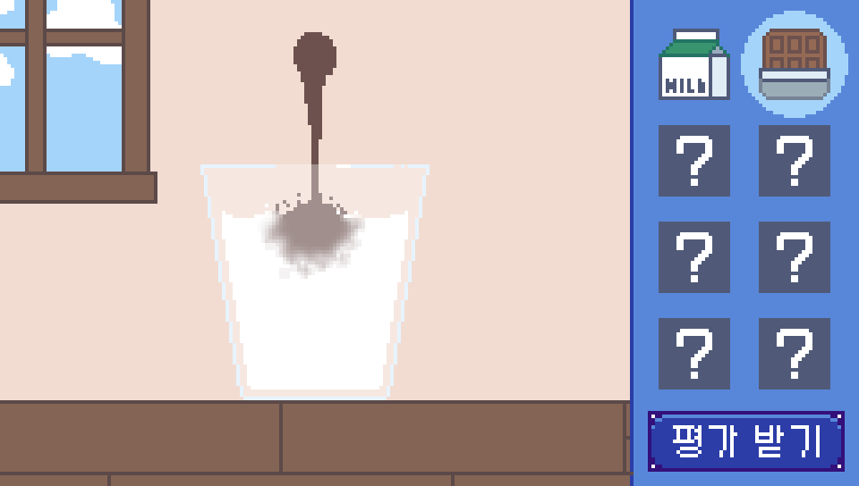

# DrinkBlender

>**카페 음료 제조 시뮬레이터** 

2022 한세대학교 IT학부 졸업프로젝트

<h2> 팀원</h2>
<ul>
  <li>202110102 안호빈</li>
  <li>201810088 이가은</li>
</ul>

<h2>현재까지의 진행사항</h2>

* **주제 **:  

* **개발 환경 구축을 위한 프로그램 설치**  
: Rust, GPU, Vscode, LiquidFun 등

* **코드 작성**  
LiquidFun을 구현할 코드를 작성(예시)

* **코드에 대한 이해**  
코드에 대한 이해와 분석의 시간 가짐

* **데이터셋**  

<h2>전체 계획대비 진행상황</h2> 

 **<진행 중 및 앞으로의 계획>**

 **<음료 제조 시뮬레이터 수행 목표>**

 **<음료 제조 시뮬레이터 적용 목표>** 
 

 
<h2>참고자료</h2>

num| 사이트
--------- | ---------
1 | https://google.github.io/liquidfun/
2 | 
3 |
4 | 
5 | 

